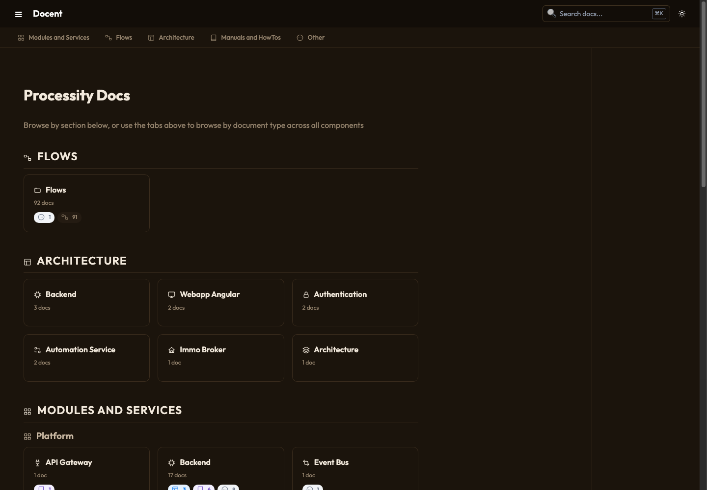
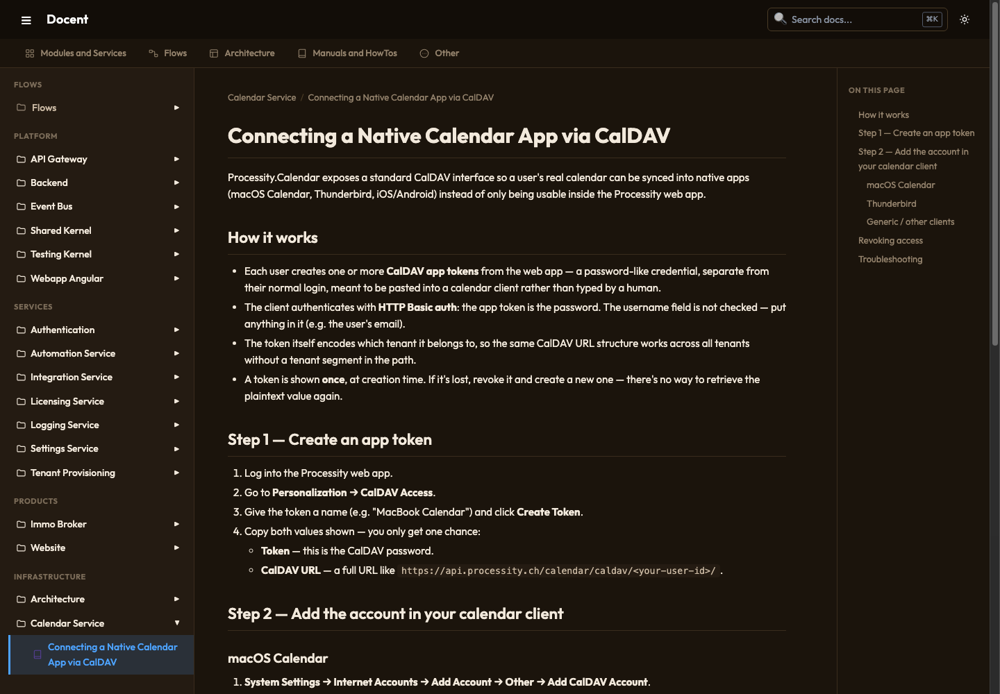
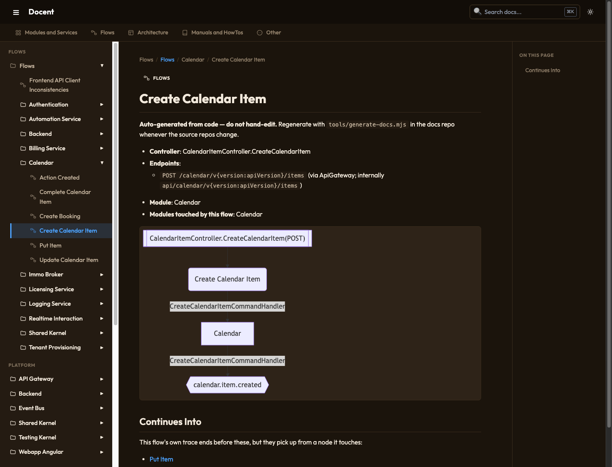
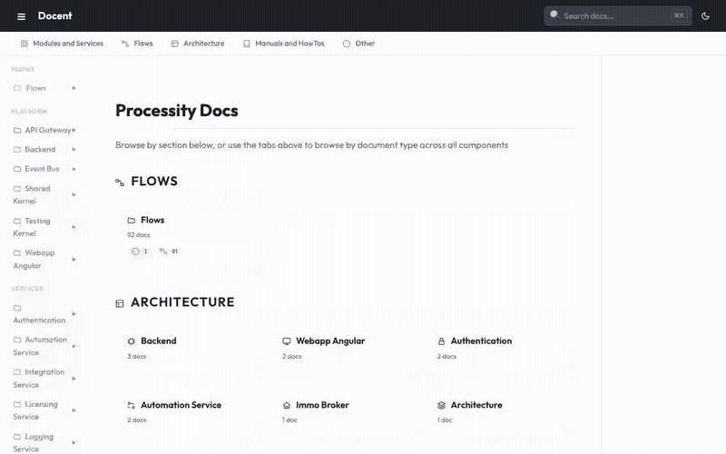
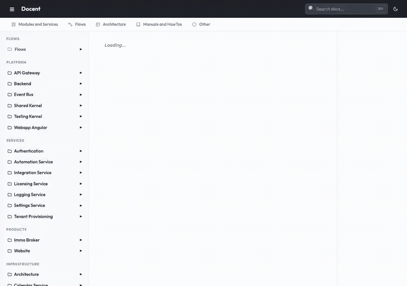

# Docent

Point it at a folder of markdown and it figures out the rest: nav tree,
search index, tabs by document type — no config required to get something
useful on screen. Point its optional companion pipeline at your own
`.NET`/Angular repos and it'll also mine them for cross-service flows
(controller → command/query → handler → event → downstream consumer) and
turn those into browsable diagrammed pages.

Two independent pieces:

- **`viewer/`** — the docs site. Works with *any* folder of markdown, from
  any source. This is the part most people want.
- **`tools/`** — an opinionated flow-doc generator for a specific stack
  (CQRS/mediator-style .NET + NSwag-generated Angular clients + Ocelot
  gateway). Optional; see [Limitations](#limitations) before relying on it.

Screenshots below are Docent running against a real, in-production docs
tree (Processity's own — a .NET modular monolith + microservices backend
with an Angular frontend) as a realistic example, not a toy fixture.

**Dashboard** — tile grid by section, tabs unselected until you pick one:



**A regular doc page** — sidebar nav grouped by module, right-hand TOC:



**A generated flow page** — mermaid diagram tracing a request across
services, from `tools/generate-docs.mjs`:



**Tabs and sidebar** — switching document-type tabs filters the sidebar;
the home link folds it away again:



**Flow diagrams** — a generated flow page's mermaid diagram, pan/zoomed,
then following a "continues into" link to the next flow page in the chain:



## Quick start

```
cd viewer
npm install
npm run dev     # http://localhost:5173, proxies its API to a local tsx server
```

By default it serves `../docs` relative to `viewer/` — drop any markdown
tree there (or point `docsDir` in `viewer.config.yaml` elsewhere) and
reload. No frontmatter, no `_nav.yml`, no naming convention required for
a working nav — everything below is about shaping that default output,
not unlocking it.

## What "throw your code at it" actually means

The only structural requirement is: a folder of `.md` files, nested
however you like. Given that alone:

- **Nav** is generated from the folder tree itself. Folder names become
  section labels (`automationservice` → "Automation Service" — see
  [title-casing](#title-casing) below); file names become page titles,
  unless the file starts with a `# Heading`, which wins.
- **Search** is built from every file's first heading (as title) and the
  rest of its stripped-markdown body — code fences, frontmatter, links,
  and images are excluded so results aren't full of syntax noise.
- **Tabs** ("Modules and Services", "Architecture", "Manuals and HowTos",
  ...) are assigned per-file by matching its path against glob patterns
  in `viewer.config.yaml`'s `docTypes` — first pattern to match wins, so
  order your patterns from most to least specific. No match → the file
  still shows up, just filed under "Other".

None of that needs curation up front. You curate on top of it, later,
only where the default guess is wrong.

## Configuring `viewer/viewer.config.yaml`

```yaml
docsDir: ../docs           # folder to serve, relative to viewer/
siteTitle: Docent          # header title

exclude:                   # globs never shown, anywhere (nav or search)
  - "node_modules/**"

navExcludeFiles:           # filenames hidden from nav, but not deleted -
  - index.md               # e.g. per-folder landing pages, changelogs
  - CHANGELOG.md            # you don't want cluttering every folder listing
  - "*.draft.md"

transparentFolders:        # folder is skipped as a nav level - its children
  - src                    # attach directly to the parent instead. Useful
  - docs                   # for repos where docs live inside "docs/" or
                            # "src/" subfolders you don't want as a label.

docTypes:                  # tab assignment, first pattern match wins
  - id: architecture
    label: Architecture
    patterns:
      - "**/architecture.md"
      - "**/*architecture*.md"
  - id: manual
    label: Manuals and HowTos
    patterns:
      - "**/*guide*.md"
      - "**/*setup*.md"
      - "**/*howto*.md"
```

A file's document type can also be set explicitly in frontmatter
(`type: manual`), which always wins over pattern matching — use that for
the exceptions, patterns for everything else.

### Per-folder nav overrides

Drop a `_nav.yml` (or `.pages`) in any folder to control just that
folder's ordering, labels, or grouping:

```yaml
title: Services
nav:
  - authentication
  - billingservice
  - Products:
      - immobroker
      - website
```

Anything in that folder **not listed** here still shows up — appended
automatically after the curated entries, alphabetically. Nothing silently
disappears just because you forgot to add a new folder to an old
`_nav.yml`; you only need to touch it to control ordering or grouping,
never to keep something visible.

### Title-casing

Folder names get de-concatenated into readable titles via a small
built-in word dictionary in `viewer/server/scanner.ts` (`KNOWN_WORDS`) —
e.g. `automationservice` → "Automation Service", `apigateway` → "API
Gateway". It only recognizes words already in that list; an unrecognized
one-word slug like `mycustomrepo` renders as "Mycustomrepo" untouched
(harmless — just add hyphens to your real folder name, or extend the
list, if that bothers you).

## How markdown gets processed

- Rendered with `markdown-it` + Shiki for syntax-highlighted code fences.
- ` ```mermaid ` fences render as live, pan/zoomable diagrams client-side.
- ` ```overview-graph ` fences render the dashboard's module/flow
  relationship graph — this is generated output from `tools/`, not
  something you write by hand.
- Headings get anchor links and populate the right-hand table of
  contents (H2–H4).
- The first `# H1` in a file is both its search-index title and, absent
  a better title source, its nav label.

## Deployment

The viewer is a Node/Express server (`viewer/server/index.ts`) that
serves a built static client plus a small JSON API (`/api/tree`,
`/api/search-index`, `/api/doc/*`). Any of these work:

**Docker** (`.docker/Dockerfile`, multi-stage: builds the client, then
runs the server):

```
docker compose -f .docker/docker-compose.example.yml up --build
```

**Plain Node**, no container:

```
cd viewer
npm install
npm run build          # client -> dist/
npm run build:server   # server -> dist-server/ (tsc)
DOCS_DIR=../docs PORT=3100 npm start
```

**Behind a reverse proxy** (nginx, Caddy, Traefik, ...): it's a normal
HTTP server on `$PORT` (default 3100) — proxy to it like any other Node
app. No websockets, no special headers required.

**Process manager** (systemd, pm2, ...): run the same `npm start` from
the plain-Node option above as the managed command; `DOCS_DIR` can point
anywhere readable, including a path mounted or synced independently of
the deploy (so docs can update without a redeploy — just hit
`POST /api/rebuild` after, or restart the process, to pick up changes).

## Flow-doc generation (`tools/`)

This is the optional half. `tools/generate-docs.mjs` scans sibling repos
**on disk** — not in the container, not via an API, actual local
checkouts — for controller → command/query → handler → event →
downstream-consumer chains, and writes one markdown page per
interesting chain under `docs/flows/`.

Configure via `generate-docs.config.json` at the repo root (never hand it
real paths inside a script — this is the only place they live):

```json
{
  "projectsRoot": "/absolute/path/to/your/projects",
  "repoNames": ["YourOrg.Backend", "YourOrg.ApiGateway"],
  "apiGatewayConfigDir": "YourOrg.ApiGateway/.docker/local/config",
  "angularSrcDir": "YourOrg.WebApp.Angular/src",
  "monolithRepoName": "YourOrg.Backend"
}
```

```
node tools/generate-docs.mjs
```

`docs/flows/` is wiped and rewritten wholesale on every run — treat it as
a build artifact, not something to hand-edit or diff-review line by line.

## Limitations

- **The viewer has no auth.** Anyone who can reach the deployed port sees
  everything under `docsDir`. Put it behind your own auth/reverse proxy
  if any of that content is sensitive.
- **Nav and search rebuild in memory on every server start** (by design —
  see Deployment above) — fine at the scale of a few hundred docs; a very
  large tree (thousands of files) will add measurable startup latency.
- **Search is entirely client-side** — the whole index ships to the
  browser on load. Fine for the doc-site sizes this was built for; a
  huge corpus would want a server-side search swap instead.
- **`tools/` is heuristic, not a compiler.** It's regex/AST-lite pattern
  matching tuned for "mostly right, cheap to run across thousands of
  files" — treat its output as a strong lead, not proof, especially for
  unusual code shapes.
- **`tools/` assumes a specific architecture**: CQRS/mediator command and
  query dispatch, an event bus with a recognizable publish pattern,
  NSwag-generated Angular API clients, and Ocelot-style gateway routing
  config. A different stack (different mediator library, GraphQL,
  gRPC, a non-NSwag client generator, a different gateway) will need the
  `extract-*.mjs` heuristics adapted — the viewer itself has no such
  assumption and works with any markdown.
- **No versioning.** Docs reflect whatever's in `docsDir` right now;
  there's no history browsing or diffing between releases built in.
- **No i18n at the site level** — one language per deployed instance.

## Contributing

See `CONTRIBUTING.md`.

## License

Apache-2.0 — see `LICENSE`.
